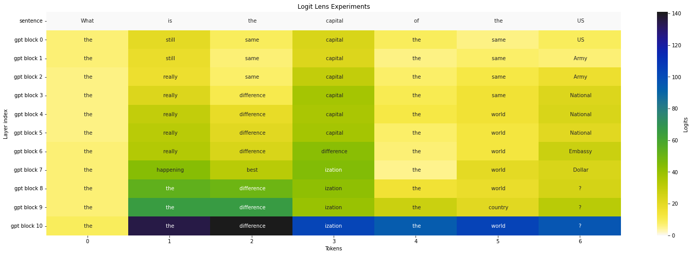

## Data visualization
 

    
## Analysis of the results

In the explanation, we will use the term logits. The logits of a model are positive numbers representing the probability of belonging to the output class: the higher the logit, the more likely it is that the input will match the output. Logits are not probabilities because they can exceed 1. To pass from logits to probability it is necessary to apply the softmax function to logits for example.

The first salient information from the results is the inequality of confidence between the last layers and the first ones. Indeed, the first layers try to find correlated words while the last layer makes a decision. This gives an idea of the architecture of the gpt2 model.

The first column is also particular. The word "What" becomes "the". To understand this phenomenon we have to go back to the logits. The model is never sure what to put after. There is nothing in its memory, so it is hard to decide. So it decides to put a generalist word like "the".

Even though GPT-3 is presented as being much better than GPT-2, it already has some sentence comprehension skills. From "What is the", it confidently completes "difference" which is a likely follow-up. Then, from "What is the capital", it predicts that the sentence is "What is the capitalization" which is also a probable sentence. Finally, he understands that the sentence is a question because he predicts that the next word is a question mark. But it is clear that GPT-2 is far from the performance of GPT-3. If we write "I love hot chocolate with", GPT-2 predicts that the next word is "chocolate".
